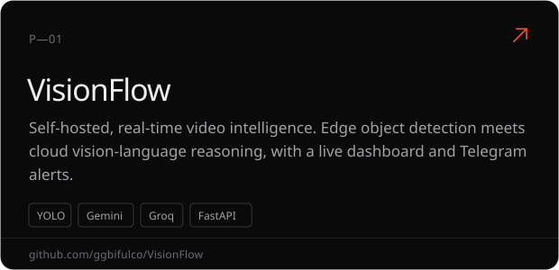
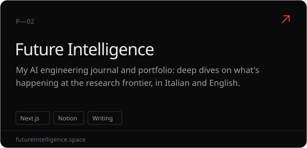
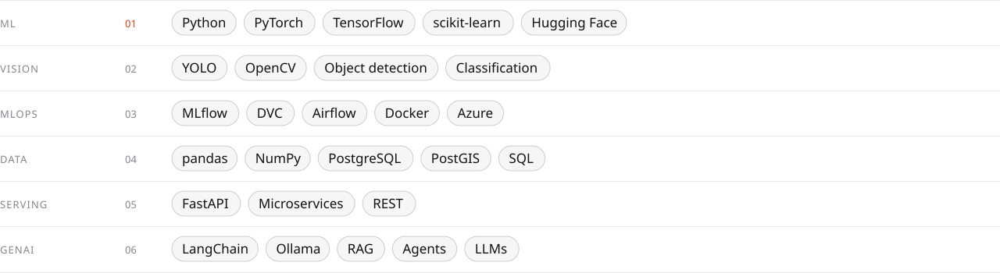
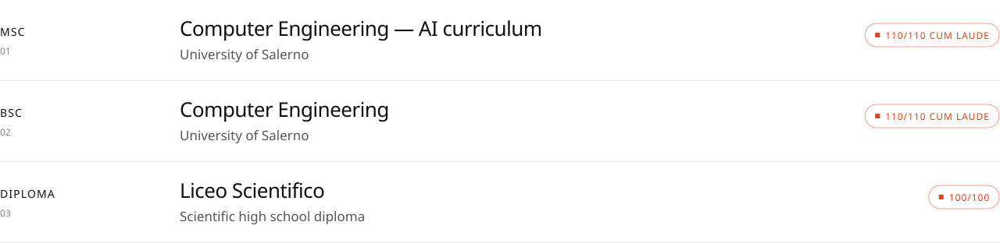

  <a href="https://futureintelligence.space"><picture><source media="(prefers-color-scheme: dark)" srcset="assets/b-portfolio.svg" /><source media="(prefers-color-scheme: light)" srcset="assets/b-portfolio-light.svg" /></picture></a>&nbsp;
  <a href="https://www.linkedin.com/in/ggbifulco"><picture><source media="(prefers-color-scheme: dark)" srcset="assets/b-linkedin.svg" /><source media="(prefers-color-scheme: light)" srcset="assets/b-linkedin-light.svg" /></picture></a>&nbsp;
  <a href="mailto:bifulcogiuseppegerardo@gmail.com"><picture><source media="(prefers-color-scheme: dark)" srcset="assets/b-email.svg" /><source media="(prefers-color-scheme: light)" srcset="assets/b-email-light.svg" /></picture></a>

ML engineer with **3+ years** taking models from raw data to deployed services, currently at **NTT DATA**. I work across computer vision, MLOps and scientific ML research — leading teams and co-authoring research with Italian universities — and I write about the AI frontier on [Future Intelligence](https://futureintelligence.space).

 

<picture><source media="(prefers-color-scheme: dark)" srcset="assets/s-work.svg" /><source media="(prefers-color-scheme: light)" srcset="assets/s-work-light.svg" /></picture>

  

<picture><source media="(prefers-color-scheme: dark)" srcset="assets/s-stack.svg" /><source media="(prefers-color-scheme: light)" srcset="assets/s-stack-light.svg" /></picture>
<picture><source media="(prefers-color-scheme: dark)" srcset="assets/stack.svg" /><source media="(prefers-color-scheme: light)" srcset="assets/stack-light.svg" /></picture>

  

<picture><source media="(prefers-color-scheme: dark)" srcset="assets/s-writing.svg" /><source media="(prefers-color-scheme: light)" srcset="assets/s-writing-light.svg" /></picture>
<a href="https://futureintelligence.space/articles/jev-system-one-models"><picture><source media="(prefers-color-scheme: dark)" srcset="assets/w-1.svg" /><source media="(prefers-color-scheme: light)" srcset="assets/w-1-light.svg" /></picture></a>
<a href="https://futureintelligence.space/articles/doppio-contactless-weight-estimation"><picture><source media="(prefers-color-scheme: dark)" srcset="assets/w-2.svg" /><source media="(prefers-color-scheme: light)" srcset="assets/w-2-light.svg" /></picture></a>
<a href="https://futureintelligence.space/articles/amie-disease-management"><picture><source media="(prefers-color-scheme: dark)" srcset="assets/w-3.svg" /><source media="(prefers-color-scheme: light)" srcset="assets/w-3-light.svg" /></picture></a>

<a href="https://futureintelligence.space/articles">All articles →</a>

 

<picture><source media="(prefers-color-scheme: dark)" srcset="assets/s-education.svg" /><source media="(prefers-color-scheme: light)" srcset="assets/s-education-light.svg" /></picture>
<picture><source media="(prefers-color-scheme: dark)" srcset="assets/education.svg" /><source media="(prefers-color-scheme: light)" srcset="assets/education-light.svg" /></picture>

  

<picture><source media="(prefers-color-scheme: dark)" srcset="assets/s-publications.svg" /><source media="(prefers-color-scheme: light)" srcset="assets/s-publications-light.svg" /></picture>
<a href="https://arxiv.org/abs/2607.26925"><picture><source media="(prefers-color-scheme: dark)" srcset="assets/p-1.svg" /><source media="(prefers-color-scheme: light)" srcset="assets/p-1-light.svg" /></picture></a>
<a href="https://papers.ssrn.com/sol3/papers.cfm?abstract_id=6790363"><picture><source media="(prefers-color-scheme: dark)" srcset="assets/p-2.svg" /><source media="(prefers-color-scheme: light)" srcset="assets/p-2-light.svg" /></picture></a>

  

<a href="https://futureintelligence.space"><picture><source media="(prefers-color-scheme: dark)" srcset="assets/footer.svg" /><source media="(prefers-color-scheme: light)" srcset="assets/footer-light.svg" /></picture></a>
