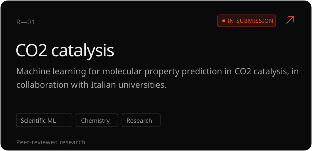
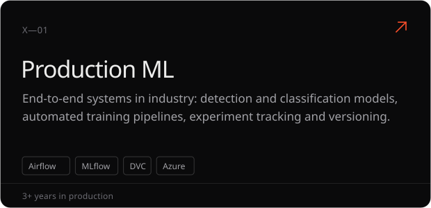

  &nbsp;
  &nbsp;
  

ML engineer with **3+ years** taking models from raw data to deployed services, currently at **NTT DATA**. I work across computer vision, MLOps and scientific ML research — leading teams and co-authoring peer-reviewed work with Italian universities — and I write about the AI frontier on [Future Intelligence](https://futureintelligence.space).

 

  

  

<a href="https://futureintelligence.space/articles">All articles →</a>

MSc Computer Engineering (AI curriculum) · 110/110 cum laude · University of Salerno

  

